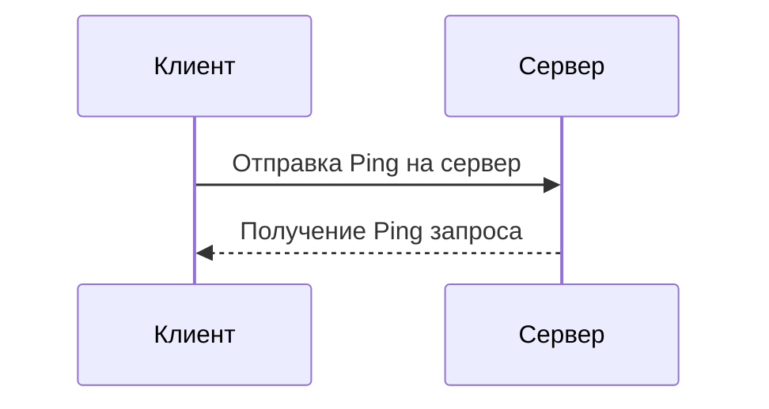
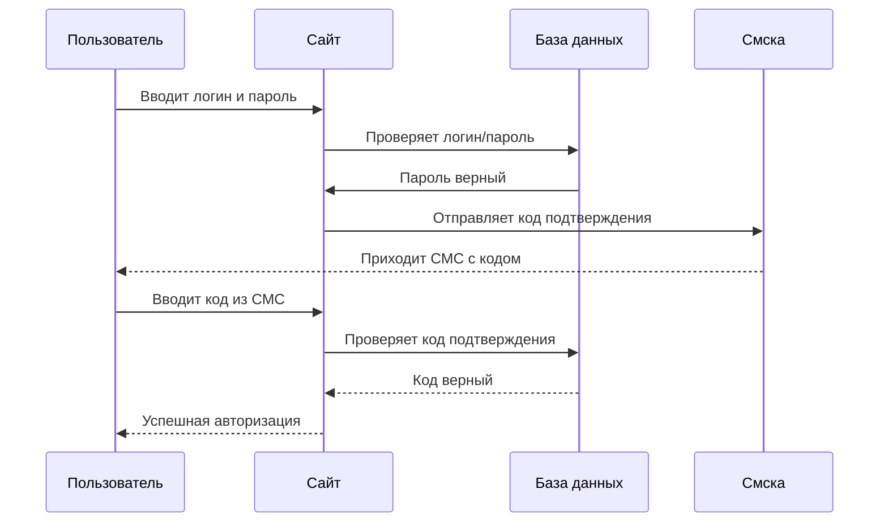
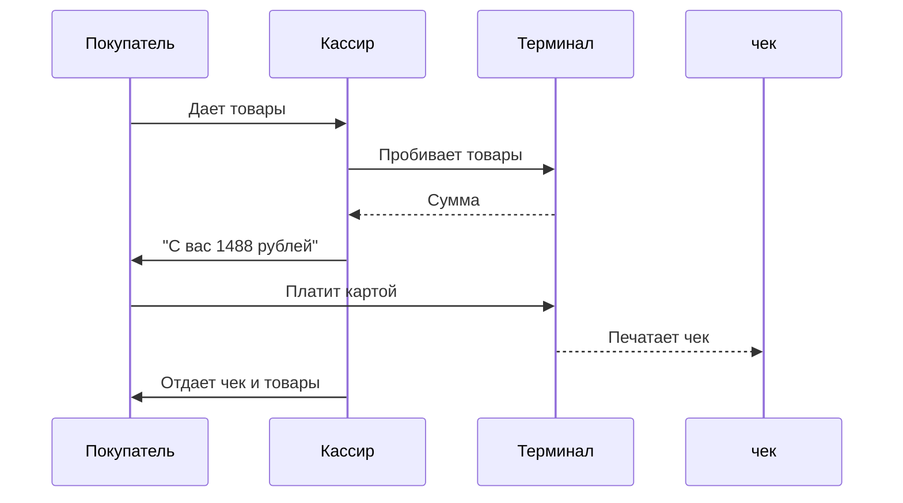
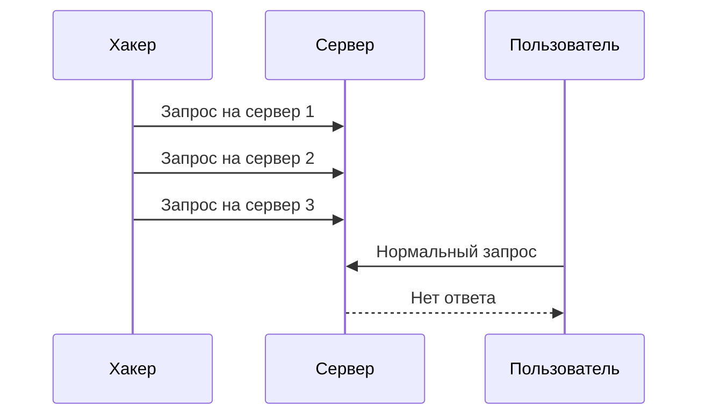

```mermaid
sequenceDiagram
Клиент->>Сервер: Отправка Ping на сервер
Сервер-->>Клиент: Получение Ping запроса
```

Задание 2

```mermaid
sequenceDiagram
Пользователь->>Сайт: Вводит логин и пароль
Сайт->>База данных: Проверяет логин/пароль
База данных->>Сайт: Пароль верный
Сайт->>Смска: Отправляет код подтверждения
Смска-->>Пользователь: Приходит СМС с кодом
Пользователь->>Сайт: Вводит код из СМС
Сайт->>База данных: Проверяет код подтверждения
База данных-->>Сайт: Код верный
Сайт-->>Пользователь: Успешная авторизация
```

Задание 3

```mermaid
sequenceDiagram
Покупатель->>Кассир: Дает товары
Кассир->>Терминал: Пробивает товары
Терминал-->>Кассир: Сумма
Кассир->>Покупатель: "С вас 1488 рублей"
Покупатель->>Терминал: Платит картой
Терминал-->>чек: Печатает чек
Кассир->>Покупатель: Отдает чек и товары
```

Задание 4

```mermaid
sequenceDiagram
Хакер->>Сервер: Запрос на сервер 1
Хакер->>Сервер: Запрос на сервер 2
Хакер->>Сервер: Запрос на сервер 3
Пользователь->>Сервер: Нормальный запрос
Сервер-->>Пользователь: Нет ответа
```
