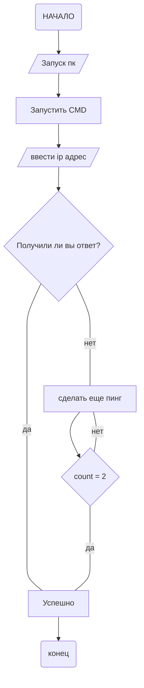
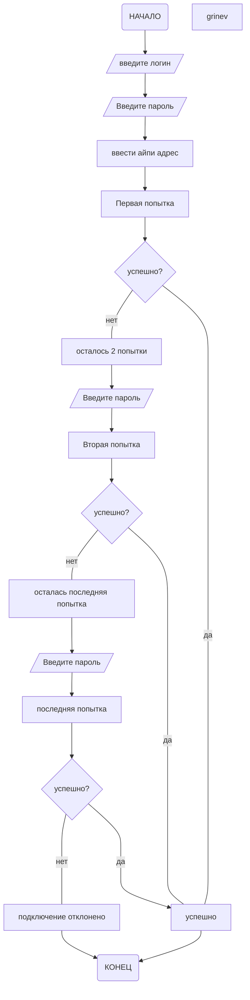
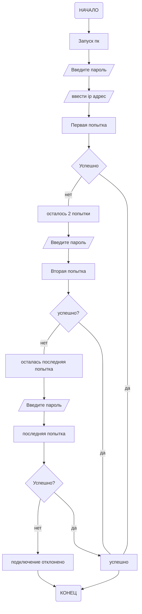
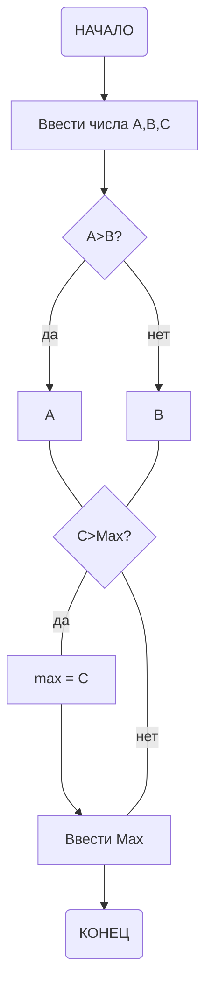

#ЗАДАНИЕ_1

```mermaid
flowchart TD

    A(НАЧАЛО) --> B[/Запуск пк/]

B --> C[Запустить CMD] --> d[/ввести ip адрес/]

d --> g{Получили ли вы ответ?}

g -- нет ----- h[сделать еще пинг]

g -- да ------- v[Успешно]

v -->e(конец)

h --> o{count = 2}

o -- нет--- h

o -- да ----- v

```

#Задание_2

```mermaid
flowchart TD
A(НАЧАЛО) --> B[/введите логин/]
B --> C[/Введите пароль/] --> d[ввести айпи адрес]
d --> u[Первая попытка]

u --> p{успешно?}

p -- нет --- v[осталось 2 попытки]

p -- да ---- m[успешно]

v --> l[/Введите пароль/]

l --> '[Вторая попытка]

' --> q{успешно?}

q -- нет --- .[осталась последняя попытка]

q -- да ----- m

. --> Х[/Введите пароль/]

Х --> а[последняя попытка]

а --> д{успешно?}

д -- нет --- в[подключение отклонено]

д -- да ----> m

в --> Ф

  
  

m --> Ф(КОНЕЦ)

grinev
```
#ЗАДАНИЕ_3 

``` mermaid
flowchart TD

    A(НАЧАЛО) --> B[Запуск пк]

B --> C[/Введите пароль/] --> d[/ввести ip адрес/]

d --> u[Первая попытка]

u --> p{Успешно}

p -- нет --- v[осталось 2 попытки]

p -- да --------- m[успешно]

v --> l[/Введите пароль/]

l --> '[Вторая попытка]

' --> q{успешно?}

q -- нет ---.[осталась последняя попытка]

q -- да -------m

. --> X[/Введите пароль/]

X --> a[последняя попытка]

a --> д{Успешно?}

д -- нет --->в[подключение отклонено]

д -- да ----> m

в --> Ф

m -->Ф(КОНЕЦ)
```

#ЗАДАНИЕ_4

```mermaid
flowchart TD

    A(НАЧАЛО) --> B[Ввести числа A,B,C]

    B --> f{A>B?}

f -- да ---> D[A]

f -- нет ---> s[B]

D --- V{С>Max?}

s --- V

V -- да --- J[max = C]

J ---> K

V -- нет --- K[Ввести Max]

K --> Ц(КОНЕЦ)
```